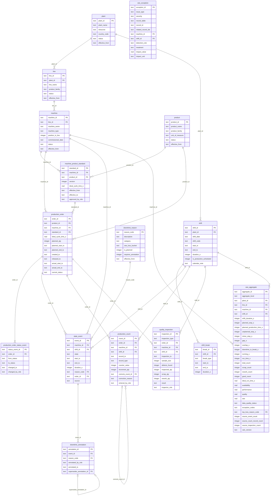

# Entity relationship diagram

Generated from `oee/schema.py`.

```mermaid
erDiagram
    plant ||--o{ line : "plant_id"
    plant ||--o{ shift : "plant_id"
    line ||--o{ machine : "line_id"
    machine ||--o{ machine_product_standard : "machine_id"
    product ||--o{ machine_product_standard : "product_id"
    shift ||--o{ shift_break : "shift_id"
    machine ||--o{ production_order : "machine_id"
    product ||--o{ production_order : "product_id"
    machine_product_standard ||--o{ production_order : "standard_id"
    production_order ||--|{ production_order_status_event : "order_id"
    machine ||--o{ state_event : "machine_id"
    shift ||--o{ state_event : "shift_id"
    production_order ||--o{ state_event : "order_id"
    downtime_reason ||--o{ state_event : "reason_code"
    state_event ||--o{ downtime_annotation : "event_id"
    downtime_annotation |o--o| downtime_annotation : "supersedes_annotation_id"
    production_order ||--o{ production_count : "order_id"
    shift ||--o{ production_count : "shift_id"
    production_count |o--o{ production_count : "corrects_count_id"
    production_order ||--o{ quality_inspection : "order_id"
    shift ||--o{ quality_inspection : "shift_id"
    shift ||--o{ oee_aggregate : "shift_id"
    machine ||--o{ oee_aggregate : "machine_id"
    plant {
        text plant_id PK
        text plant_name
        text timezone
        text country_code
        text status
        text effective_from
    }
    line {
        text line_id PK
        text plant_id FK
        text line_name
        text product_family
        text status
        text effective_from
    }
    machine {
        text machine_id PK
        text line_id FK
        text machine_name
        text machine_type
        integer position_in_line
        text commissioned_date
        text status
        text effective_from
    }
    product {
        text product_id PK
        text product_name
        text product_family
        text unit_of_measure
        text status
        text effective_from
    }
    machine_product_standard {
        text standard_id PK
        text machine_id FK
        text product_id FK
        integer version
        real ideal_cycle_time_s
        text effective_from
        text effective_to
        text approved_by_role
    }
    downtime_reason {
        text reason_code PK
        text description
        text category
        text oee_loss_bucket
        integer is_planned
        integer requires_annotation
        text effective_from
    }
    shift {
        text shift_id PK
        text plant_id FK
        text shift_date
        text shift_code
        text start_ts
        text end_ts
        integer duration_s
        integer is_production_scheduled
        text calendar_note
    }
    shift_break {
        text break_id PK
        text shift_id FK
        text break_type
        text start_ts
        text end_ts
        integer duration_s
    }
    production_order {
        text order_id PK
        text product_id FK
        text machine_id FK
        text standard_id FK
        real ideal_cycle_time_s
        integer planned_qty
        text planned_start_ts
        text planned_end_ts
        text created_ts
        text released_ts
        text actual_start_ts
        text actual_end_ts
        text current_status
    }
    production_order_status_event {
        text status_event_id PK
        text order_id FK
        text from_status
        text to_status
        text changed_ts
        text changed_by_role
    }
    state_event {
        text event_id PK
        text machine_id FK
        text shift_id FK
        text state
        text start_ts
        text end_ts
        integer duration_s
        text reason_code FK
        text order_id FK
        text source
    }
    downtime_annotation {
        text annotation_id PK
        text event_id FK
        text reason_code FK
        text annotated_by_role
        text annotated_ts
        text supersedes_annotation_id FK
    }
    production_count {
        text count_id PK
        text order_id FK
        text machine_id FK
        text shift_id FK
        text record_ts
        text record_type
        integer counter_value
        integer increment_qty
        text corrects_count_id FK
        text correction_reason
        text entered_by_role
    }
    quality_inspection {
        text inspection_id PK
        text inspection_type
        text order_id FK
        text machine_id FK
        text shift_id FK
        text inspection_ts
        integer sample_size
        integer defects_found
        integer inspected_qty
        integer scrap_qty
        integer rework_qty
        text result
        text inspector_role
    }
    oee_aggregate {
        text aggregate_id PK
        text aggregate_level
        text plant_id FK
        text line_id FK
        text machine_id FK
        text shift_id FK
        integer shift_duration_s
        integer planned_stop_s
        integer planned_production_time_s
        integer unplanned_stop_s
        integer minor_stop_s
        integer gap_s
        integer overlap_s
        integer downtime_in_break_s
        integer running_s
        integer run_time_s
        integer total_count
        integer scrap_count
        integer rework_count
        integer good_count
        real ideal_run_time_s
        real availability
        real performance
        real quality
        real oee
        text data_quality_status
        text exception_codes
        text top_loss_reason_code FK
        integer source_event_count
        integer source_count_record_count
        integer source_inspection_count
        text calc_version
    }
    oee_exception {
        text exception_id PK
        text issue_type
        text severity
        text record_table
        text record_id
        text related_record_ids
        text machine_id FK
        text shift_id FK
        text detection_rule
        text treatment
        real impact_value
        text impact_unit
    }
```
